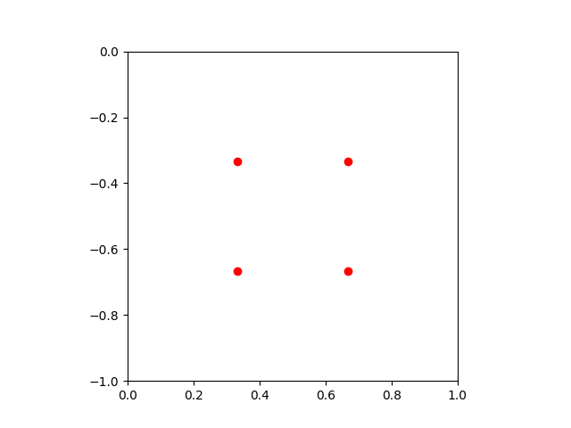
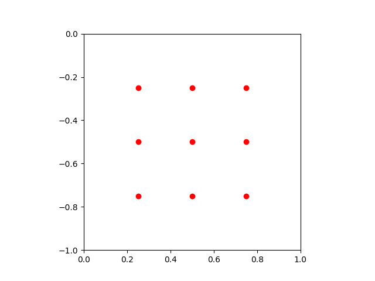

# Documentation

## Table of Contents
- [Documentation](#documentation)
  - [Table of Contents](#table-of-contents)
  - [Author](#author)
  - [General](#general)
  - [Sections](#sections)
    - [(Fundamental) Rendering loop (5 points)](#fundamental-rendering-loop-5-points)
    - [(Fundamental) Camera (15 points)](#fundamental-camera-15-points)
    - [(Fundamental) Objects: shape (15 points)](#fundamental-objects-shape-15-points)
    - [(Fundamental) Enhancing camera and rendering loop (10 points)](#fundamental-enhancing-camera-and-rendering-loop-10-points)
    - [(Fundamental) Object material: diffuse (15 points)](#fundamental-object-material-diffuse-15-points)
    - [(Fundamental) Object material: specular (20 points)](#fundamental-object-material-specular-20-points)
    - [(Optional) Object material: specular transmission (30 points)](#optional-object-material-specular-transmission-30-points)
    - [(Optional) Lights (30 points)](#optional-lights-30-points)
    - [(Optional) Positioning and orienting camera (30 points)](#optional-positioning-and-orienting-camera-30-points)
    - [Additional stuff](#additional-stuff)
      - [Command line interface](#command-line-interface)
      - [Gif creation](#gif-creation)


## Author

- Name: Niklas Frondorf

## General

- There is no *Scene* or *Camera* Object
- The Camera is represented by a base vector in the struct *Raytracer* called `camera_pos` and a `direction` which is calculated at runtime 
  - Both of them are passed to the function `cast_ray`

## Sections

### (Fundamental) Rendering loop (5 points)
The main rendering loop(s) can be found in the function `start` of the struct `Raytracer`. The function will iterate over every pixel (height and width), calculate the color of the pixel and store that color. After the loops are done the image is stored to disk in a png format. Blow you can see a snippet of the main loop(s). Note, that the snippet is simplified for better understanding.
```rust
let img = image::RgbImage::new(WIDTH, HEIGHT);
for h in 0..HEIGHT {
    for w in 0..HEIGHT {
        color = calc_color_at_pixel(w, h, ...);
        img.put_pixel(w, h, image::Rgb(color));
    }
} 
save_image(img, ...);
```

---
### (Fundamental) Camera (15 points)
In this project the camera is represented by a base vector `camera_pos` (specified in the struct `Raytracer`) and a direction vector `direction`, which is calculated at runtime. In the function `calc_color_at_pixel` of the struct `Raytracer` the color is calculated by casting a ray from the position of the camera (`camera_pos`) in a certain direction (`direction`). The function `cast_ray` returns the color for the pixel. Blow you can see a snippet, which shows how the ray is casted. Note, that the snippet is simplified for better understanding.
```rust
color = cast_ray(camera_pos, direction.normalize(), ...);
```

---
### (Fundamental) Objects: shape (15 points)
The only real objects in this project are spheres. Spheres are defined as follows:
```rust
pub struct Sphere {
    pub center: vec3,
    pub radius: f32,
    pub material: Material,
}
```
The intersection of rays and spheres is handled by the function `intersect_between_ray_and_sphere`. Blow you can see a snippet, which shows how the intersection is handled. Note, that the snippet is simplified for better understanding.
```rust
let vec_to_center = sphere.center - origin;
let projection_of_dir_to_center = vec_to_center * direction;
let discriminant = vec_to_center * vec_to_center - pow(projection_of_dir_to_center, 2.0);
if discriminant < pow(sphere.radius, 2.0) {
    let tmp = sqrt(pow(sphere.radius, 2.0) - discriminant);
    let t0 = projection_of_dir_to_center - tmp;
    let t1 = projection_of_dir_to_center + tmp;
    if t0 > offset_for_mitigating_occlusion {
        return (true, t0);
    } else if t1 > offset_for_mitigating_occlusion {
        return (true, t1);
    }
}
return (false, 0.0);
```
The calculation of the actual color is done in the function `cast_ray`. More on that later.

---
### (Fundamental) Enhancing camera and rendering loop (10 points)
The anti-aliasing is implemented in the function `calc_color_at_pixel` as follows:
```rust
let color = vec3 {0, 0, 0};
for i in 0..anti_aliasing_offsets.len() {
    color += cast_ray(camera_pos, (direction + anti_aliasing_offsets[i]).normalize(), ...);
}
color = (color / anti_aliasing_offsets.len());
```
You can specify the amount of rays per pixel with the `anti_aliasing` argument in the function `new` of the struct `Raytracer`. Note that the number of rays per pixel ($n$) is equal to the `anti_aliasing` argument ($a$) squared $\Rightarrow$ $n = a^2$. This is, because the offsets for each pixel are calculated as follows:
```rust
let anti_aliasing_offsets: Vec<(f32, f32)> = vec![];
for i in 1..anti_aliasing + 1 {
    for j in 1..anti_aliasing + 1 {
        anti_aliasing_offsets.push(
            (j / (anti_aliasing + 1), -i / (anti_aliasing + 1))
        );
    }
}
```
This results in uniformly distributed points inside each pixel. Here are two examples of offset distributions with 2 and 3 as input respectively.
<center>
 
</center>

---
### (Fundamental) Object material: diffuse (15 points)
Material in this project are defined as follows:
```rust
pub struct Material {
    pub refractive_index: f32,
    pub diffuse_multiplier: f32,
    pub specular_multiplier: f32,
    pub reflection_multiplier: f32,
    pub refraction_multiplier: f32,
    pub color: vec3,
    pub specular_exponent: f32,
}
```
The diffuse color is calculated in the function `cast_ray` of the struct `Raytracer` as follows:
```rust
let diffuse_color = material.color * diffuse_light_intensity * material.diffuse_multiplier;
```
More on the calculation of `diffuse_light_intensity` [here](#optional-lights-30-points).

---
### (Fundamental) Object material: specular (20 points)
For definition of materials see [here](#fundamental-object-material-diffuse-15-points).
The specular color is calculated in the function `cast_ray` of the struct `Raytracer` as follows:
```rust
let specular_color = material.color * specular_light_intensity * material.specular_multiplier;
```
More on the calculation of `specular_light_intensity` [here](#optional-lights-30-points).

---
### (Optional) Object material: specular transmission (30 points)

The change of the direction of light without a change in color is accomplished by setting the right values when creating a material. There is no different way of handling such internal refractions than regular refraction in code. An example for the material *glass* can be found in preset 4.

---
### (Optional) Lights (30 points)
A Light consists of a position vector (`pos`) and an intensity value (`intensity`) and is defined as follows:
```rust
pub struct Light {
    pub pos: vec3,
    pub intensity: f32,
}
```

The intensity of colors in regards to the light is calculated as follows:
```rust
let diffuse_light_intensity = 0;
let specular_light_intensity = 0;
for light in lights {
    let light_dir = (light.pos - point).normalize();
    let (hit, shadow_pt, _, _) = self.scene_interact(point, light_dir);

    if !(hit && (shadow_pt - point).norm() < (light.pos - point).norm()) {
        diffuse_light_intensity += max(0, light_dir * normal) * light.intensity;

        let tmp_base = max(0, -self.reflect(-light_dir, normal) * direction);
        specular_light_intensity += pow(tmp_base, material.specular_exponent) * light.intensity;
    }
}
```
Note, that the snippet is simplified for better understanding.

---
### (Optional) Positioning and orienting camera (30 points)
An implementation of the look-at transform can be found in the implementation of the struct `vec3`. The function calculates the look-at transformation matrix and directly applies the transformation to a vector the ist also passed to the function. Blow you can see a snippet, which shows how the intersection is handled. Note, that the snippet is simplified for better understanding.

```rust
pub fn look_at(from: vec3, to: vec3, vec: vec3) -> vec3 {
    let forward = (from - to).normalize();
    let right = vec3 {
        x: 0.0,
        y: 1.0,
        z: 0.0,
    }
    .cross(forward);
    let up = forward.cross(right);

    let translation_x = -from * right;
    let translation_y = -from * up;
    let translation_z = -from * forward;

    let transformation_matrix = ndarray::arr2(&[
        [right.x, up.x, forward.x, 0.0],
        [right.y, up.y, forward.y, 0.0],
        [right.z, up.z, forward.z, 0.0],
        [translation_x, translation_y, translation_z, 1.0],
    ]);

    let vec_ = ndarray::arr1(&[vec.x, vec.y, vec.z, 0.0]);
    let new_vec = transformation_matrix.dot(&vec_);

    return vec3 {
        x: new_vec[0],
        y: new_vec[1],
        z: new_vec[2],
    };
}
```
The function is used for the `gif` subcommand in the cli. More on the `cli` [here](#gif-creation)

---
### Additional stuff

#### Command line interface
The program can be used completely by a easy to use command line interface. Usage:
```
$ cargo run --bin main -- --help
Usage: main [OPTIONS] [COMMAND]

Commands:
  img   create a single image
  gif   create multiple images, that can be combined into a gif
  help  Print this message or the help of the given subcommand(s)

Options:
      --width <width>
          Width of the image [default: 600]
      --height <height>
          Height of the image [default: 400]
  -o, --output <output_path>
          Path where to store results (creates folder if not found) [default: out]
  -d, --max-depth <max_depth>
          Max. depth of reflected rays [default: 4]
  -a, --anti-aliasing <anti_aliasing>
          Set scale of anti aliasing (number of rays per pixel = <argument> ^ 2) [default: 2]
      --occlusion-offset <occlusion_offset>
          Offset for mitigation occlusion [default: 0.1]
      --fov <fov>
          Field of view [default: 1.0]
  -p, --preset <preset>
          Select preset [1-3] [default: 1]
      --look-at-pos <look_at_pos>
          Set position of point to look at [default: 0,-4,-20]
      --versionize
          If set output images are being saved with the datetime as prefix
  -h, --help
          Print help
  -V, --version
          Print version
```

Example usage:
- Create an image in full hd resolution from (0,10,10), looking at (0,0,-20) with preset 1
  - `cargo run --bin main -- --width=1920 --height=1080 --camera-pos=0,10,10 --look-at-pos=0,0,-20 --preset=1`


#### Gif creation
It is not an animation of the objects in the scene, but an animation of the camera. This is what is behind the `gif` subcommand` in the [CLI](#command-line-interface). You can specify a center point, where the camera is rotation around in a circle, a radius for the circle, the height of the circle (y-level), a number of images, that should be taken turing one full rotation on the circle and a point to look at.
The images are being uniformly distributed on the circle (same distance between neighboring points). For each point a [look-at transformation](#optional-positioning-and-orienting-camera-30-points) is done in order for the camera to always point to the desired point. Example output (preset 3):

